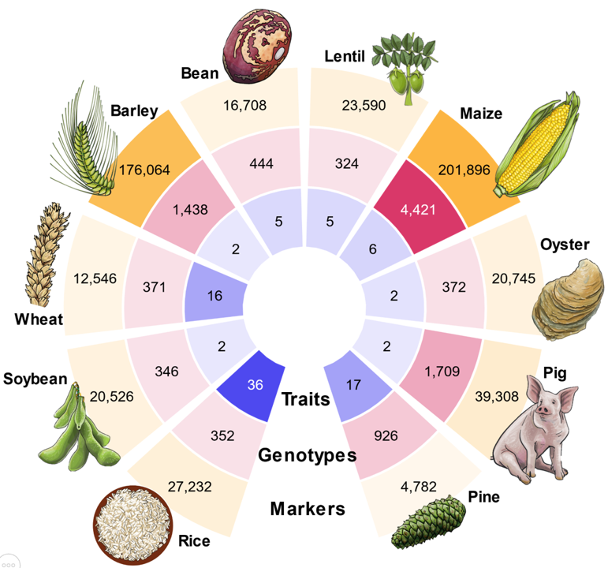

# EasyGeSe

EasyGeSe is a comprehensive [database](https://zenodo.org/records/15348871) for genomic selection with data records from diverse species such as [barley](https://link.springer.com/article/10.1007/s00122-021-03815-0), [common bean](https://bmcgenomics.biomedcentral.com/articles/10.1186/s12864-020-07213-6), [catfish](https://academic.oup.com/g3journal/article/12/1/jkab361/6408442),  [lentil](https://doi.org/10.1002/tpg2.20002), [loblolly pine](https://academic.oup.com/genetics/article/190/4/1503/6064084), [Eastern oyster](https://doi.org/10.1093/g3journal/jkab368), [maize](https://doi.org/10.1186/s13104-020-4922-8), [pig](https://doi.org/10.1111/age.13121), [rice](https://www.nature.com/articles/ncomms1467), [soybean](https://doi.org/10.1007/s00122-017-2951-z) and [wheat](https://doi.org/10.1038/s41597-022-01651-5). 

The data are formatted, filtered and arranged in easy to use formats; with functions in R and Python for easy loading.

# Code
Find out how to use EasyGeSe with your favourite programing language below or in the specific `README.md` in each subdirectory.

For all tools the options are:

| Option | Reference |
| ------ | ------ |
| "barley" | Gonzalez, Maria Y., et al. \'Genomic prediction models trained with historical records enable populating the German ex situ genebank bio-digital resource center of barley (Hordeum sp.) with information on resistances to soilborne barley mosaic viruses.\' Theoretical and Applied Genetics 134 (2021): 2181-2196. |
| "bean" | Diaz, Santiago, et al. \'Genetic mapping for agronomic traits in a MAGIC population of common bean (Phaseolus vulgaris L.) under drought conditions.\' BMC genomics 21.1 (2020): 1-20. |
| "lentil" | Haile, Teketel A., et al. \'Genomic selection for lentil breeding: Empirical evidence.\' The Plant Genome 13.1 (2020): e20002. |
| "maize" | Washburn, Jacob D., et al. \'Global genotype by environment prediction competition reveals that diverse modeling strategies can deliver satisfactory maize yield estimates.\' Genetics 229.2 (2025): iyae195|
| "oyster" | McCarty, Alexandra J., Standish K. Allen Jr, and Louis V. Plough. ‘Genome-wide analysis of acute low salinity tolerance in the eastern oyster Crassostrea virginica and potential of genomic selection for trait improvement.’ G3 12.1 (2022): jkab368. |
| "pig" | Xie, L., et al. ‘Accurate prediction and genome‐wide association analysis of digital intramuscular fat content in longissimus muscle of pigs.’ Animal Genetics 52.5 (2021): 633-644. |
| "pine" | Resende Jr, M. F. R., et al. \'Accuracy of genomic selection methods in a standard data set of loblolly pine (Pinus taeda L.).\' Genetics 190.4 (2012): 1503-1510. |
| "rice" | Zhao, Keyan, et al. 'Genome-wide association mapping reveals a rich genetic architecture of complex traits in Oryza sativa.' Nature communications 2.1 (2011): 467. |
| "soybean" | Kaler, Avjinder S., et al. 'Genome-wide association mapping of canopy wilting in diverse soybean genotypes.' Theoretical and Applied Genetics 130 (2017): 2203-2217.   Kaler, Avjinder S., et al. ‘Genome‐wide association mapping of carbon isotope and oxygen isotope ratios in diverse soybean genotypes.’ Crop science 57.6 (2017): 3085-3100. |
| "wheatG" | Gogna, Abhishek, et al. 'Gabi wheat a panel of European elite lines as central stock for wheat genetic research.' Scientific Data 9.1 (2022): 538. |

